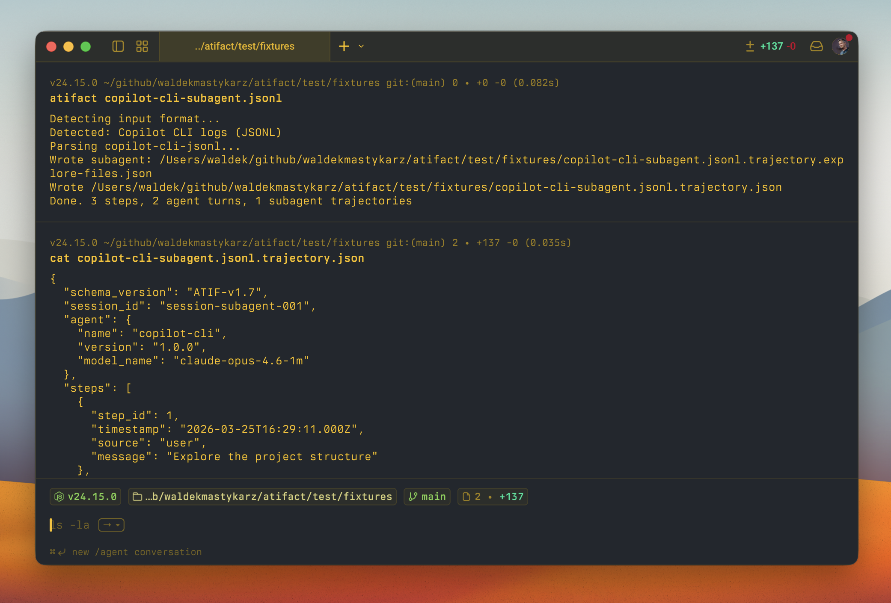

# atifact

[](https://skills.sh/waldekmastykarz/atifact)

Convert agent logs to [ATIF](https://harborframework.com/docs/agents/trajectory-format) trajectories. One command. Zero dependencies.

Turn HAR files, Vally trajectories, Claude Code logs, Copilot CLI logs, and Codex CLI logs into standardized [ATIF v1.8](https://github.com/harbor-framework/harbor/blob/main/rfcs/0001-trajectory-format.md) trajectory JSON — ready for debugging, visualization, fine-tuning, and RL pipelines.



## Use with AI agents

Give your AI coding agent the atifact skill so it can extract trajectories on your behalf:

```sh
npx skills add waldekmastykarz/atifact
```

Once installed, ask your agent to _"extract the trajectory from this HAR file"_, _"convert Claude Code logs to ATIF"_, _"convert Copilot CLI logs"_, or _"convert Codex CLI logs"_ and it will handle the rest.

## Install

```sh
npm install -g atifact
```

## Quick start

```sh
# Convert a HAR file (auto-detected)
atifact session.har

# Convert Claude Code logs
atifact claude-log.jsonl

# Convert Copilot CLI logs
atifact copilot-session.jsonl

# Convert Codex CLI logs
atifact codex-session.jsonl

# Convert a standalone Vally Trajectory object
atifact vally-trajectory.json

# Pipe to stdout (returns JSON array of trajectories)
atifact session.har --json | jq '.steps | length'
```

Output: `<input>.trajectory.json` in ATIF v1.8 format. Copilot CLI and Codex CLI logs with subagents produce additional `<input>.trajectory.<name>.json` files.

`--json` mode outputs a single trajectory with subagents embedded in the `subagent_trajectories` array to stdout with no files written.

## Programmatic API

Install atifact as a project dependency:

```sh
npm install atifact
```

Convert serialized log content directly from memory:

```ts
import { convert } from "atifact";

const { trajectory, subagentTrajectories } = await convert(jsonlContent);
```

Strings are treated as content, not file paths. `Uint8Array` input is also supported. Use `convertFile` to read from a path:

```ts
import { convertFile } from "atifact";

const result = await convertFile("session.jsonl");
```

Both functions detect the input format by default. The format can be forced and a source name can be included in the trajectory notes:

```ts
const result = await convert(content, {
	format: "har",
	utilityModels: ["gpt-4o-mini"],
	sourceName: "captured request",
});
```

Use `detectFormat(content)` for in-memory input or `await detectFileFormat(path)` for a file. The package exports the ATIF trajectory and parser result TypeScript types alongside these functions.

## Supported inputs

| Format | Source | Flag |
|---|---|---|
| HAR | OpenAI Chat Completions API, OpenAI Responses API, Anthropic Messages API | `har` |
| JSONL | Claude Code CLI session logs | `claude-code-jsonl` |
| JSONL | Copilot CLI session logs | `copilot-cli-jsonl` |
| JSONL | Codex CLI `exec --json` logs | `codex-cli-jsonl` |
| JSON | Vally `Trajectory` object | `vally-json` |

Format is auto-detected from file contents (not extension). Force it with `-f`:

```sh
atifact myfile.log -f claude-code-jsonl
atifact myfile.log -f copilot-cli-jsonl
atifact myfile.log -f codex-cli-jsonl
atifact trajectory.json -f vally-json
```

## Usage

```
atifact <input-file> [options]
```

| Option | Description |
|---|---|
| `-o, --output <prefix>` | Output path prefix (default: input file path). Main: `<prefix>.trajectory.json`, subagents: `<prefix>.trajectory.<name>.json` |
| `-f, --format <fmt>` | Force input format: `har`, `claude-code-jsonl`, `copilot-cli-jsonl`, `codex-cli-jsonl`, `vally-json` |
| `--json` | Write trajectory to stdout with subagents embedded (no files written) |
| `-q, --quiet` | Suppress progress messages |
| `-h, --help` | Show help |
| `--version` | Print version |

### Exit codes

| Code | Meaning |
|---|---|
| `0` | Success |
| `1` | Runtime error (parse failure, I/O error) |
| `2` | Invalid usage (bad arguments, missing file) |

## Output format

atifact produces [ATIF v1.8](https://github.com/harbor-framework/harbor/blob/main/rfcs/0001-trajectory-format.md) JSON with:

- **Steps** — user messages, agent responses, tool calls, and observations
- **Metrics** — token counts, costs, cached tokens per step
- **Tool calls** — structured function name + arguments with observation results
- **Subagent trajectories** — Copilot CLI and Codex CLI subagents produce separate trajectory files linked via `subagent_trajectory_ref` with `trajectory_id` resolution; `--json` mode embeds them in `subagent_trajectories`
- **Final metrics** — aggregated totals across the trajectory
- All timestamps preserved as ISO 8601 from source data
- Null/undefined fields excluded for compact output

ATIF v1.8 supports audio content parts. atifact's current input parsers do not extract audio from source logs.

## Examples

### HAR → trajectory

```sh
atifact recording.har -o my-trajectory
# Writes: my-trajectory.trajectory.json
```

### Claude Code → trajectory, piped

```sh
atifact ~/.claude/projects/*/sessions/*.jsonl --json --quiet > trajectory.json
```

### Copilot CLI → trajectory with subagents

```sh
atifact copilot-session.jsonl
# Writes: copilot-session.jsonl.trajectory.json
# Writes: copilot-session.jsonl.trajectory.<subagent-name>.json (per subagent)
```

### Codex CLI → trajectory

```sh
atifact codex-session.jsonl
# Writes: codex-session.jsonl.trajectory.json
```

### Vally → trajectory

```sh
atifact vally-trajectory.json
# Writes: vally-trajectory.json.trajectory.json
```

### Count agent steps

```sh
atifact session.har --json | jq '[.steps[] | select(.source == "agent")] | length'
```

## Requirements

- Node.js 22+

## License

[MIT](LICENSE)